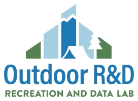
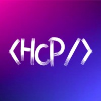

# About Me

I'm **David**! Happy you're here!

## Professional Experience

- Software Developer @ Outdoor Recreation and Data Lab (09/2024 - *Present*)
- Lead Developer @ AI Institute in Dynamic Systems (10/2022 - *Present*)
- Project Manager/Lead Developer @ Husky Coding Project (01/2024 - 11/2024)

  

## Academics

I am majoring in Applied Computational Mathematical Sciences (Data Science & Statistics) at the University of Washington. I will be graduating this Sping (2025)!

## Hobbies
- Frisbee &#129359;
- Hiking &#9968;
- Running &#127939;
- Biking &#128690;
- Juggling &#129358;
- Climbing &#129704;
- Calisthenics &#128170;

## Words of Wisdom

> Q: "What's cooler than throwing a frisbee?
>
> A: "Throwing a glow-in-the-dark frisbee at night." &#127769;

## Favorite Hikes in Washington

| Hike | Roundtrip Length (mi) |
| --- | --- |
| Mail Box Peak	| 9.4|
| Poo Poo Point	| 7.2|
| Snow Lake	| 7.2|
| Lake 22	| 5.4|
| Rattlesnake Ledge|	4.0|

## [Learn more about me!](https://davidye007.github.io/AboutMe/ "Learn more about David")